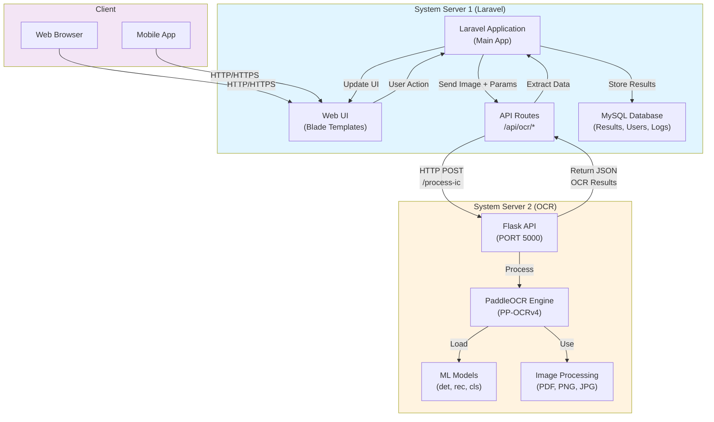
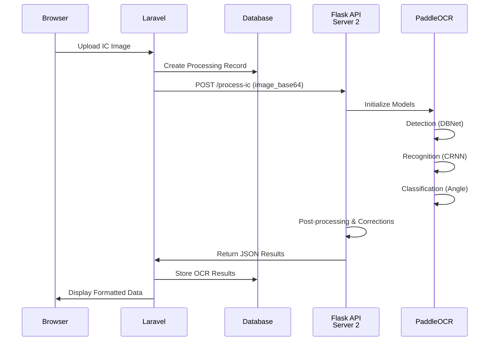

# System Architecture: OCR API Integration with Laravel

## Overview
The system separates OCR processing (Server 2) from the main application (Server 1) for better scalability and resource management.



## Server Configuration

### Server 1 (Laravel) - Main Application
- **Location**: `c:\laragon\www\ProjectName`
- **Framework**: Laravel 10+
- **Port**: 80/443 (HTTP/HTTPS)
- **Database**: MySQL
- **Responsibilities**:
  - User Authentication
  - Web Interface
  - API Gateway for OCR requests
  - Data Storage & Management
  - Result Processing & Display

### Server 2 (OCR) - Processing Engine
- **Location**: `c:\laragon\www\PaddleOCR`
- **Framework**: Flask
- **Port**: 5000
- **ML Engine**: PaddleOCR (PP-OCRv4_mobile)
- **Responsibilities**:
  - Image Reception & Validation
  - OCR Processing
  - Results Formatting
  - Logging & Monitoring

## API Communication Flow

### Request Flow (Laravel → OCR)
```
1. User uploads Malaysia IC image via Laravel UI
2. Laravel validates file (format, size)
3. Laravel sends POST request to Server 2
   POST http://SERVER2_IP:5000/process-ic
   {
       "image_base64": "...",
       "image_format": "jpg",
       "language": "malay",
       "return_raw_ocr": true
   }
4. Flask API processes image
5. Flask returns OCR results
```

### Response Format
```json
{
    "success": true,
    "data": {
        "ic_number": "941116-14-5047",
        "name": "SAIFULAZRI BIN MOHD SHAFIEE",
        "gender": "Male",
        "religion": "ISLAM",
        "address": "LOT 4622 KG MAHKOTA, JALAN SUNGAI TUA, 68100 BATU CAVES, SELANGOR",
        "document_type": "Malaysia Identity Card (MyKad)",
        "orientation_angle": 0,
        "raw_ocr_text": [...]
    }
}
```

## Data Flow Sequence



## Network Configuration

### Server 2 (OCR) - Flask Configuration
```python
# flask_api.py
app.run(
    host='0.0.0.0',  # Accept requests from Server 1
    port=5000,
    debug=True,
    use_reloader=True
)
```

### Server 1 (Laravel) - API Configuration
```php
// config/services.php
'ocr_api' => [
    'url' => env('OCR_API_URL', 'http://SERVER2_IP:5000'),
    'timeout' => 60,
    'retry_attempts' => 3,
],
```

### Laravel `.env`
```
OCR_API_URL=http://192.168.x.x:5000
OCR_API_KEY=your-api-key
OCR_PROCESS_ENDPOINT=/process-ic
```

## Security Considerations

1. **Firewall Rules**
   - Server 1 → Server 2: Allow TCP port 5000
   - External → Server 1: Allow TCP 80/443 only
   - External → Server 2: Block direct access

2. **API Authentication**
   - Add API key header validation in Flask
   - HTTPS/TLS for inter-server communication
   - Request signing with HMAC

3. **Data Privacy**
   - Temporary image files cleanup
   - No persistent storage of raw images on Server 2
   - Encryption of data in transit

## Advantages of This Architecture

✅ **Scalability**: Scale OCR independently from web app
✅ **Resource Isolation**: Heavy ML processing doesn't affect web server
✅ **Modularity**: Easy to update/replace components
✅ **Load Distribution**: Distribute OCR requests across multiple servers
✅ **Maintenance**: Separate deployment cycles
✅ **Monitoring**: Independent logging and monitoring

## Integration Steps (Next Phase)

1. Deploy Flask API to Server 2
2. Configure Laravel routes for OCR endpoints
3. Create API client service in Laravel
4. Add image upload handling in Laravel controllers
5. Implement result storage in database
6. Build web UI for display
7. Add error handling & retry logic
8. Deploy to production with security measures
