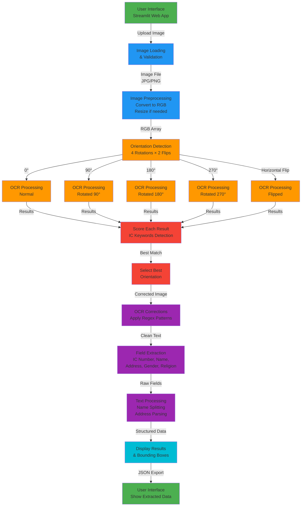

# Malaysia IC OCR Application - Complete Workflow Explanation

## Overview
The Malaysia IC OCR application is a Streamlit web application that extracts text and structured data from Malaysian Identity Card (IC) images using PaddleOCR deep learning models.

---

## Architecture Diagram



---

## Detailed Process Flow

### 1. **Image Loading & Validation** (Lines 45-90)
```
Input: User uploads image (JPG, PNG)
Process:
  - Load image using PIL
  - Display original image info
  - Check image size and dimensions
  - Resize if > 1200px (prevent memory issues)
  - Convert to RGB format
Output: numpy array ready for processing
```

### 2. **Orientation Detection** (Lines 95-195)
```
Process Multiple Orientations:
  For each rotation (0°, 90°, 180°, 270°):
    For each flip type (Normal, Horizontal):
      1. Apply flip transformation (if needed)
      2. Rotate image (if needed)
      3. Run PaddleOCR on transformed image
      4. Score results based on:
         - IC number pattern detection (+3 points)
         - Malaysia IC keywords (+2 points)
         - Text line count (tiebreaker)
      5. Store best score & image orientation

Logic: Tests 8 combinations total (4 rotations × 2 flips)
Goal: Find best orientation for accurate OCR
```

### 3. **PaddleOCR Processing**
```
Model: PP-OCRv4_mobile (lightweight, CPU-optimized)
Input: Image array (8 combinations)
Output:
  - Detected text boxes
  - Recognized text (rec_texts)
  - Bounding box coordinates (rec_polys)
  - Confidence scores
```

### 4. **Scoring System** (Lines 160-180)
```
Score Calculation:
  base_score = 0
  
  If IC keywords found (KAD PENGENALAN, WARGANEGARA, etc.):
    score += 2
  
  If IC number pattern found (XXXXXX-XX-XXXX):
    score += 3
  
  Best selection criteria:
    1. Highest IC detection score
    2. If tied: Most text lines detected
    3. If tied: Prefer normal orientation (no flip)
```

### 5. **OCR Text Corrections** (Lines 361-395)
```
Apply regex-based corrections for common OCR errors:
  - Letter L vs digit 1: L{2,}OT → LOT
  - Letter O vs digit 0: 1oo → 100
  - Merged words: AMIRAZIO → AMIR AZIQ
  - Double letters: SERAYAA → SERAYA A
  - Postal codes: 88 A 60 → 88450
  - And 14+ more patterns
```

### 6. **Field Extraction** (Lines 410-750)
```
Extract 6 Key Fields:

A) IC Number (Lines 410-420)
   Pattern: \d{6}-\d{2}-\d{4}
   Example: 950325-12-5119

B) Name (Lines 420-530)
   - Find lines containing BIN/BINTI keywords
   - Split Malay words using dictionary
   - Apply regex fixes
   - Limit to max 2 lines

C) Gender (Lines 540-560)
   - Look for LELAKI (Male) or PEREMPUAN (Female)

D) Religion (Lines 565-590)
   - Match keywords: ISLAM, BUDDHA, KRISTIAN, HINDU

E) Address (Lines 600-720)
   - Collect lines with address keywords
   - Format postal codes, states
   - Handle compound place names

F) Display Classification (Lines 395-410)
   - Check for Malaysia IC markers
   - Flag if not a Malaysia IC
```

### 7. **Text Processing Functions**

#### split_malay_words() (Lines 330-345)
```
Purpose: Fix merged Malay words
Examples:
  NORLIYANA BINTIMOHD → NORLIYANA BINTI MOHD
  KAMPUNGLAWAR → KAMPUNG LAWAR
  KUALALUMPUR → KUALA LUMPUR
```

#### correct_ocr_errors() (Lines 318-330)
```
Purpose: Apply all regex corrections
Uses: ocr_corrections list (14 patterns)
Applies: flags=re.IGNORECASE
```

### 8. **Display Results** (Lines 750-780)
```
Output Components:
  ✓ Extracted IC Number
  ✓ Extracted Name
  ✓ Extracted Gender
  ✓ Extracted Religion
  ✓ Extracted Address
  ✓ Orientation info (which flip/rotation used)
  ✓ Detection statistics (score by angle)
  ✓ Corrected image display (if rotated/flipped)
  ✓ Bounding boxes (optional checkbox)
  ✓ JSON export option
  ✓ Raw text dump (debug)
```

---

## Key Components

### Dependencies
```
streamlit        - Web UI framework
paddleocr        - Deep learning OCR
numpy            - Image array operations
opencv (cv2)     - Image processing
PIL/Pillow       - Image loading
re               - Regular expressions
```

### Configuration
```
Model: PP-OCRv4_mobile (lightweight)
Device: CPU (optimized for servers)
Max Image Size: 1200px (prevents OOM)
Upload Limit: 20MB (configured)
Cache: Streamlit cache_resource for model
```

### Error Handling
```
- MemoryError: Image too large
- ValueError: Invalid image format
- OCR failures: Try all 8 orientations
- No valid results: Show error message
- Regex errors: Fallback to basic processing
```

---

## Data Flow Summary

```
User Upload
    ↓
Load & Validate (PIL)
    ↓
Convert to NumPy Array
    ↓
Test 8 Orientations (Rotate + Flip)
    ↓
OCR Each Orientation (PaddleOCR)
    ↓
Score Results (IC keywords)
    ↓
Select Best Orientation
    ↓
Apply Regex Corrections (14 patterns)
    ↓
Extract Fields (IC, Name, Address, etc.)
    ↓
Process Text (Malay word splitting)
    ↓
Display Results (Streamlit UI)
    ↓
Optional: Show Bounding Boxes
    ↓
Export as JSON
```

---

## Important Functions

| Function | Purpose | Lines |
|----------|---------|-------|
| `load_ocr()` | Initialize PaddleOCR model (cached) | 21-32 |
| `correct_ocr_errors()` | Apply regex-based text corrections | 318-330 |
| `split_malay_words()` | Fix merged Malay words | 330-345 |
| Main Processing | Image upload → OCR → Extraction | 45-791 |

---

## Performance Optimizations

1. **Model Caching**: Load model once with `@st.cache_resource`
2. **Image Resizing**: Max 1200px to fit in memory
3. **Garbage Collection**: `gc.collect()` after large operations
4. **Lightweight Model**: PP-OCRv4_mobile instead of full model
5. **CPU Processing**: Optimized for CPU inference

---

## Example Processing Timeline

```
1. User uploads IC image (950325-12-5119.jpg)
   ↓
2. Image loaded & resized if needed (10% progress)
   ↓
3. Test 8 orientations (20-65% progress)
   - 0° normal → Score: 5 (IC found)
   - 90° rotation → Score: 2 (partial text)
   - 180° rotation → Score: 1 (no IC)
   - 270° rotation → Score: 0 (upside down)
   - 0° + flip → Score: 3 (some text)
   - etc...
   ↓
4. Select 0° normal as BEST (Score: 5)
   ↓
5. Apply corrections (AMIRAZIO → AMIR AZIQ)
   ↓
6. Extract fields:
   - IC: 950325-12-5119 ✓
   - Name: AMIR AZIQ BIN ALIM PANDITA ✓
   - Gender: LELAKI ✓
   - Religion: ISLAM ✓
   - Address: LOT 146 SERAYA A... ✓
   ↓
7. Display results (100% progress)
```

---

## Supported IC Card Information

The application extracts:
- **IC Number**: 12-digit format (XXXXXX-XX-XXXX)
- **Name**: Full name with BIN/BINTI
- **Gender**: LELAKI (Male) or PEREMPUAN (Female)
- **Religion**: ISLAM, BUDDHA, KRISTIAN, HINDU, LAIN-LAIN
- **Address**: Full mailing address with postal code and state

---

## Configuration Files

- `.streamlit/config.toml` - Upload size limit (20MB)
- `malaysia_ic_ocr.py` - Main application
- `requirements.txt` - Python dependencies
